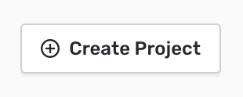
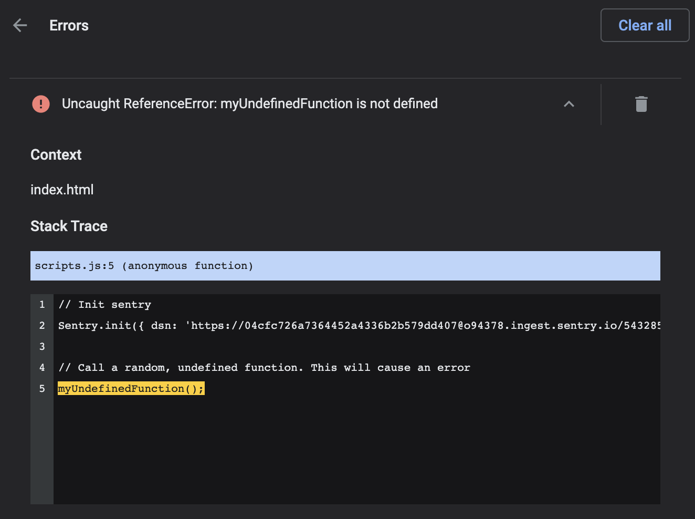

_Note: I originally published this article on [ChromeExtensionKit](https://ChromeExtensionKit.com)._

--

So you've built a Chrome Extension and published it to the store, but how do you ensure it's running smoothly for your users? Unlike a normal web service, it's a bit tougher to figure out when things go wrong within a Chrome Extension and even more frustrating to try and recreate the issue while attempting to debug it. It's important to try and figure out a way to track errors that pop up before they appear in the form of a bad review on your extension.

Fortunately, there are a number of error logging services available that can be added to your Chrome Extension with just a little bit of work.

## Choosing a Service

The first step is figuring out which service you'd like to use. There are an endless amount of error monitoring and reporting tools out there, so I'll list a few you can look into in order to see which fits your needs. Some of these include:

- [Sentry](https://sentry.io/)
- [HoneyBadger](https://www.honeybadger.io/)
- [Rollbar](https://rollbar.com/)
- [BugSnag](https://www.bugsnag.com/)
- [AirBrake](https://airbrake.io/)
- And many more!

For the purpose of this walkthrough, I'm going to go ahead and choose Sentry. I've used the service many times in the past and love how easy it is to get setup, plus they have a pretty decent free plan if you're just getting started. If you'd like to follow along using Sentry, just head over to their site and sign up for an account, if not, feel free to use your own tool and simply change it to your tool's config when we add the setup details.

## Getting Started

To get started, I'm going to head into the Sentry Dashboard and create a new Project. You'll find the button in the top right of your Projects page.



Next, I'm going to choose **Browser Javascript** as the project type. If your extension uses NPM or Yarn (i.e. you are building with React, etc), then you should pick simply **Javascript** as it will walk you through installing the package via NPM. Most providers should also have a similar basic JavaScript variation. Once you create your project, you will most likely be provided with some instructions to add a script similar to this:

```html
<script
  src="https://browser.sentry-cdn.com/5.23.0/bundle.min.js"
  integrity="sha384-5yYHk2XjpqhbWfLwJrxsdolnhl+HfgEnD1UhVzAs6Kd2fx+ZoD0wBFjd65mWgZOG"
  crossorigin="anonymous"
></script>
```

And the corresponding `init` function looking something like:

```js
Sentry.init({ dsn: 'my-sentry-dsn-here' });
```

There are 2 ways we can actually add this to our extension. The first, and easiest way, is if your extension has it's own HTML page (i.e. new tab, popup, etc) which allows you to simply add the above script tag and to init the script via your own JS file. The second option is if your extension runs in the background, in which case you would need to dynamically inject the above script tag and init it afterwards, most likely via background scripts.

For the sake of this simple walkthrough, we'll go over the first method in the next section.

## Adding To Your Extension

Let's start by creating a new example extension with 3 files: `manifest.json`, `index.html`, and `scripts.js`.

- `manifest.json`: the extension manifest file
- `index.html`: the HTML for our sample extension
- `scripts.js`: this is the script we load into our page and other than initializing Sentry, it would also include your overall extension logic most likely

The `manifest.json` file will look like:

```json
{
  "manifest_version": 2,
  "name": "Error Tracking Example",
  "version": "1.0.0",
  "browser_action": {
    "default_popup": "index.html",
    "default_title": "Open Popup"
  },
  "content_security_policy": "script-src 'self' https://browser.sentry-cdn.com; object-src 'self'"
}
```

It's important to note that the `content_security_policy` portion is what allows our Sentry script to load and communicate cross-origin (i.e. send the error back). By default, Chrome Extensions disable all cross-origin requests to mitigate potential cross-site scripting attacks. In this case, we are letting Chrome know that we want to load from the specific Sentry origin. For more information, [click here](https://developer.chrome.com/extensions/contentSecurityPolicy).

The `index.html` file will look like:

```html
<!DOCTYPE html>
<html lang="en">
  <head>
    <meta charset="UTF-8" />
    <title>Error Tracking Example</title>
    <link rel="stylesheet" href="css/index.css" />
  </head>
  <body>
    <p>Hello World!</p>
    <script
      src="https://browser.sentry-cdn.com/5.23.0/bundle.min.js"
      integrity="sha384-5yYHk2XjpqhbWfLwJrxsdolnhl+HfgEnD1UhVzAs6Kd2fx+ZoD0wBFjd65mWgZOG"
      crossorigin="anonymous"
    ></script>
    <script src="scripts.js"></script>
  </body>
</html>
```

And finally, the `scripts.js` file will look like (init for Sentry and our extension logic, which is just an error in this example):

```js
// Init sentry
Sentry.init({ dsn: 'my-dsn-here' });

// Call a random, undefined function. This will cause an error
myUndefinedFunction();
```

## Testing It Out

Now that we have our test extension setup, navigate over to `chrome://extensions/` and make sure you have _Developer Mode_ enabled.

Next, load the unpacked extension and click the extension icon in the browser bar.

If you navigate back to `chrome://extensions/`, you should see errors have popped up for the extension locally. If we didn't have error monitoring, a user could run into this situation and we would have no idea that it happened nor could we reproduce it (unless they provided us with necessary information).



This isn't great because this may result in some negative reviews on the Web Store before we can even attempt to fix it. Fortunately, error handling has us covered here.

In order to see it in action, we can navigate back to our Sentry Dashboard and see if that error has been captured and sent to us there. If all goes well, you should see something similar to the following:


If you were to click on the issue, you would be presented with more information such as where the error happened, the user's Chrome version, OS type, and more, which can provide you with context to help solve the issue.

## Final Notes

As mentioned briefly, this example assumes your extension has an HTML page, however not all extensions will work like this. In the event that your extension doesn't have an HTML page to output, or if you also need error tracking outside of the scripts referenced in the HTML page, you would need to include Background Scripts that inject the script tag and init Sentry. This would take 2 parts: updating the manifest to reference your new Background Script and adding the initialization into the Background Script itself.

Another point worth mentioning is the inclusion of the Sentry library via the CDN. This can be avoided if you download the source code for your error tracking tool and bundle that with your extension, however this can come with its own challenges, such as having to ensure that file is kept up to date as new versions are released (which may require you to push an update to the web store for your extension with the latest Sentry code).

I hope this provided you with a basic introduction to error handling in the Chrome Extension environment so you can be confident in the future that your extensions are running smoothly for all users.

As always, if you have any questions, feel free to reach out to me on [Twitter](https://twitter.com/rfitzio) and I'll do my best to help out!
